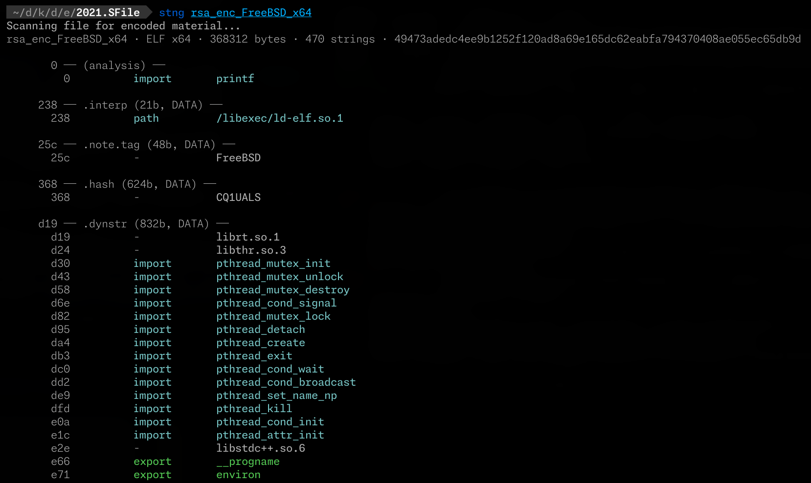

# stng

[](https://github.com/atomdrift-project/stng/releases/latest)
[](LICENSE)

stng is an open-source string extractor for malware analysis and reverse
engineering. It finds ordinary, encoded, XOR-obfuscated, and language-specific
strings while filtering the compiler noise that makes `strings(1)` output hard
to use.

Use it for quick triage, C2 and credential discovery, or preparing a focused
set of strings for YARA and incident-response work. Analysis is local and does
not require a network connection, account, or API key.

<p align="center">
  
</p>

## Why stng?

- **Useful output by default.** Filters low-value noise while keeping an
  `--unfiltered` escape hatch.
- **Understands compiled languages.** Recovers Go and Rust string layouts,
  symbols, and x86/arm64 stack strings.
- **Finds obfuscated text.** Detects common encodings, single-byte XOR, custom
  keys, and optional deeper multi-byte XOR scans.
- **Highlights security signals.** Classifies URLs, IPs, hostnames, commands,
  suspicious paths, wallets, tokens, API keys, and ransom-note text.
- **Easy to automate.** Human-readable, simple line-oriented, and JSON output
  come from one small CLI.

## Install

### Homebrew on macOS or Linux

```bash
brew tap atomdrift/tap https://github.com/atomdrift-project/homebrew-tap.git
brew install atomdrift/tap/stng
```

### Build from source

Source builds require Git, Make, a C/C++ toolchain, and Rust 1.94 or newer.

```bash
git clone https://github.com/atomdrift-project/stng.git
cd stng
make install
```

You can also install directly with Cargo:

```bash
cargo install --git https://github.com/atomdrift-project/stng
```

[Rizin](https://rizin.re/) or [radare2](https://rada.re/n/) is optional. When
present, stng can recover additional addresses and perform `--xorscan`; without
either tool it skips those passes.

## Quick start

```bash
# Full analysis with automatic single-byte XOR detection.
stng malware.bin

# Keep the most useful structured and security-relevant strings.
stng --interesting malware.bin

# Emit machine-readable output.
stng --json malware.bin

# Decode with a known key.
stng --xor 0xAB malware.bin
stng --xor secretkey malware.bin

# Run the slower multi-byte XOR pass (requires Rizin or radare2).
stng --xorscan malware.bin
```

Run `stng --help` for filtering, grouping, cache, and output controls.

## What it extracts

- ASCII and UTF-16LE strings with file offsets
- Base64, Base32, Base85, hexadecimal, URL, and Unicode-escape payloads
- Go and Rust runtime string layouts and Go `pclntab` symbols
- x86 and arm64 stack strings
- decoded Python, JavaScript, PHP, and PowerShell payload text
- Mach-O code-signing, entitlement, and universal-binary context

Rizin/radare2 results and extracted strings are cached by content to accelerate
repeat analysis. The cache defaults to a 30-day TTL and a 2 GiB ceiling; see the
`STNG_CACHE_*` environment variables and `stng --help` for controls.

Issues and pull requests are welcome in the
[GitHub repository](https://github.com/atomdrift-project/stng).

## License

stng is available under the [Apache License 2.0](LICENSE).
