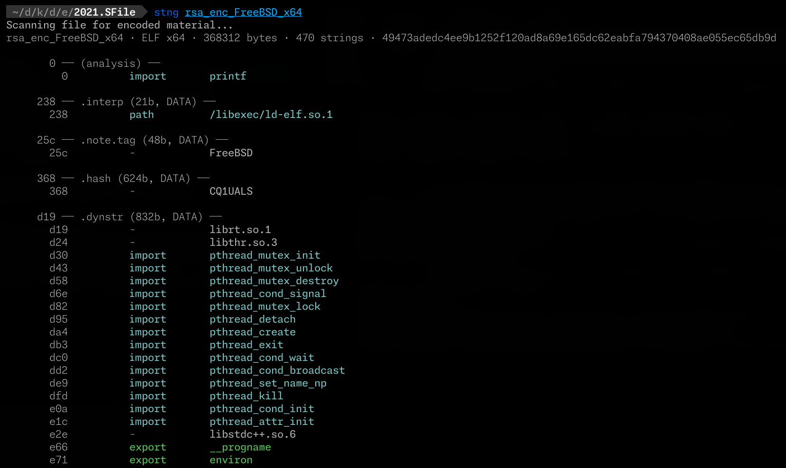

# stng

[](https://github.com/atomdrift-project/stng/releases/latest) [](LICENSE)

`strings(1)` for malware analysis. stng finds plain, encoded and XOR-obfuscated
strings, understands Go and Rust binaries, and flags URLs, IPs, commands and
suspicious paths.

<p align="center"></p>

## Install

```bash
brew install atomdrift-project/tap/stng
# or, with Rust 1.94+ and a C compiler:
cargo install --git https://github.com/atomdrift-project/stng
```

Optional: [Rizin](https://rizin.re/) or [radare2](https://rada.re/n/) finds more strings and enables `--xorscan`.

## Use

```bash
stng malware.bin              # strings by section, XOR detection on
stng -i malware.bin           # skip raw-scan noise
stng --json malware.bin       # machine-readable output
stng --xor 0xAB malware.bin   # decode with a known key (hex or text)
stng --xorscan malware.bin    # slow multi-byte XOR search
```

## As a library

```toml
stng = { git = "https://github.com/atomdrift-project/stng", default-features = false }
```

```rust
let opts = stng::ExtractOptions::new(4).with_garbage_filter(true).with_xor(None);
for s in stng::extract_strings_with_options(&bytes, &opts) {
    println!("{:#x} {:?} {}", s.data_offset, s.kind, s.value);
}
```

`default-features = false` leaves out the CLI's dependencies.

Base64-encoded zlib text is decompressed automatically, including literals
embedded in scripts or binary files. The decoder verifies the zlib checksum
and limits both decoded input and inflated output to 10 MiB. UTF-8 and UTF-16LE
text use `Base64Decode`; source offsets and lengths still identify the encoded
token. No sample code is executed.

## License

[Apache 2.0](LICENSE)
